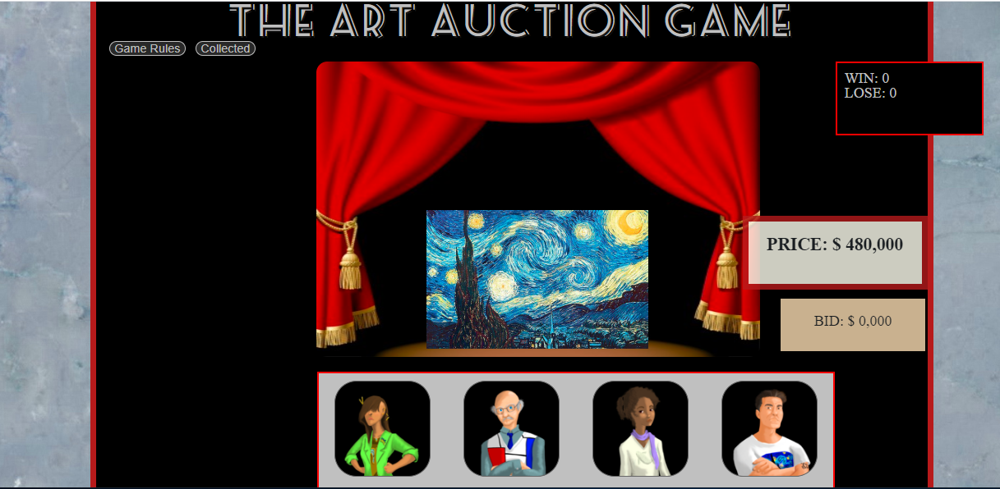

# The Art Auction Game

Visit the page here: https://mrterranova.github.io/The_Art_Auction_Game/
  

# Overview
Welcome to the art auction game. Upon opening the page, you will find the directions on the left hand side. 

The essence of the game is that you are now a proud owner of a museum. However, you need to purchase timeless masterpieces in order to fill your new museum. This is exactly why four talented and essential art critics have come to help you find the right paintings for the right price. Each of the critics has a set amount that they will give you. You must then match the price that they agree the image is worth. If you guess correctly then you get to collect the painting. 

# Technology used
- jQuery
- HTML
- CSS

# Deployment
This was deployed directly on the github page. No special requirements were needed in order to do so. 

# Details
Even though this was one of my first coding projects, I wanted to include a personal touch to this project in particular. Since I have a masters in animation, I wanted to include characters that I drew. I was also eager to include the beginnings of saving certain images or "paintings" without a database. 

As it does not contain a database, it will erase previous details if the page is refreshed. So the challenge is to collect all the paintings in one sitting! 

Mobile responsive as well!
  
